# Results

Figures generated by `main.py` and `validation.py`.

## N₂O sweeps (`main.py`)

**SPI mass flow vs. pressure drop** (reproduces Waxman Fig. 2.2)
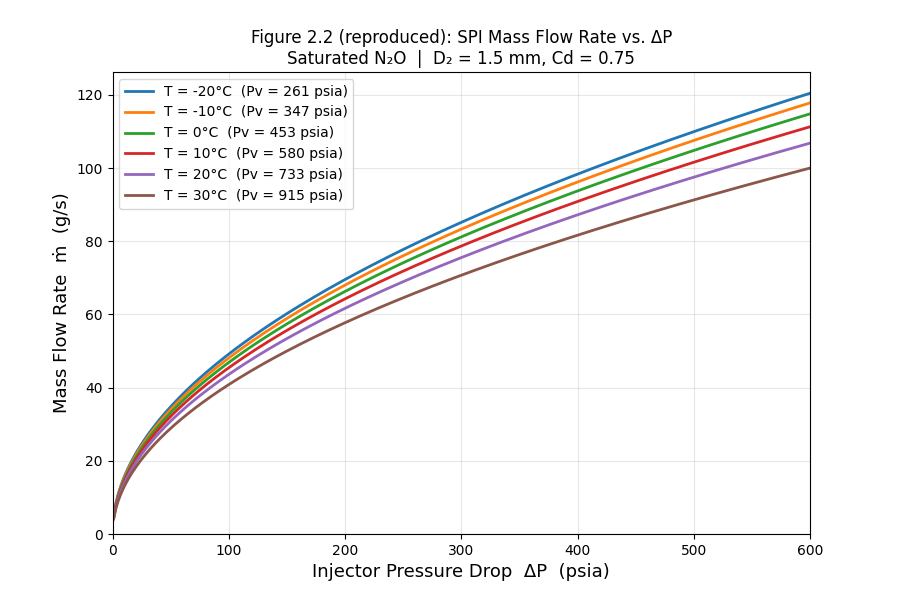

**SPI mass flow vs. back pressure** (reproduces Waxman Fig. 2.3)
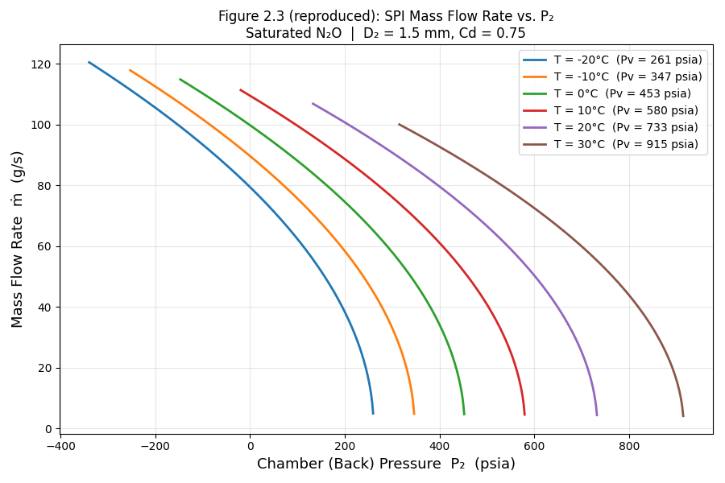

**HEM vs. SPI, saturated N₂O** (reproduces Waxman Fig. 2.20)
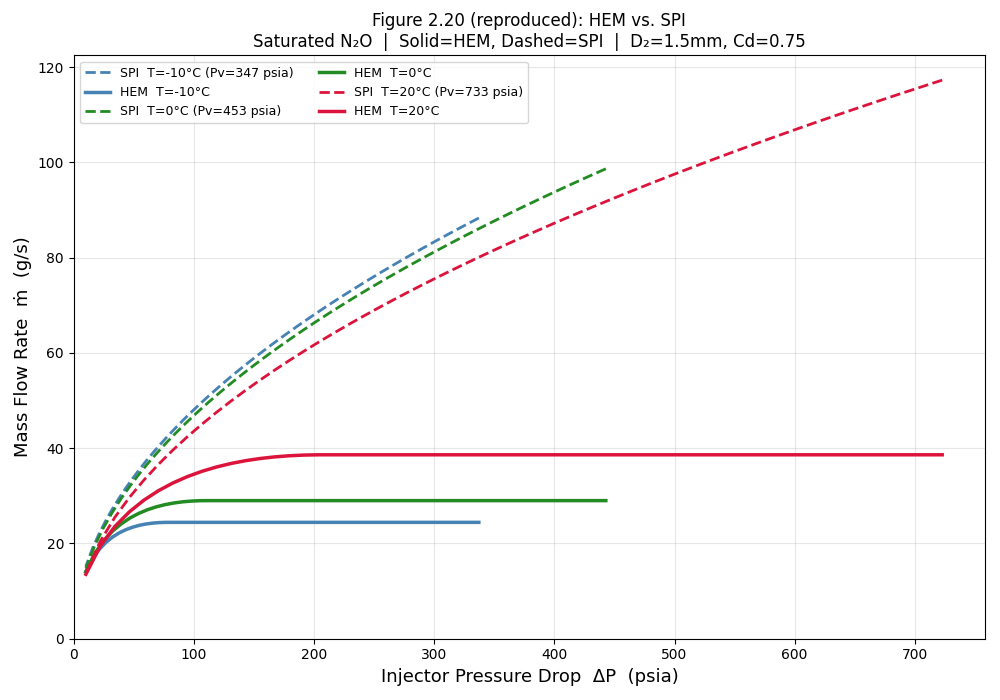

**All models at T = 0 °C, saturated.** Dyer collapses onto HEM because k = 0.
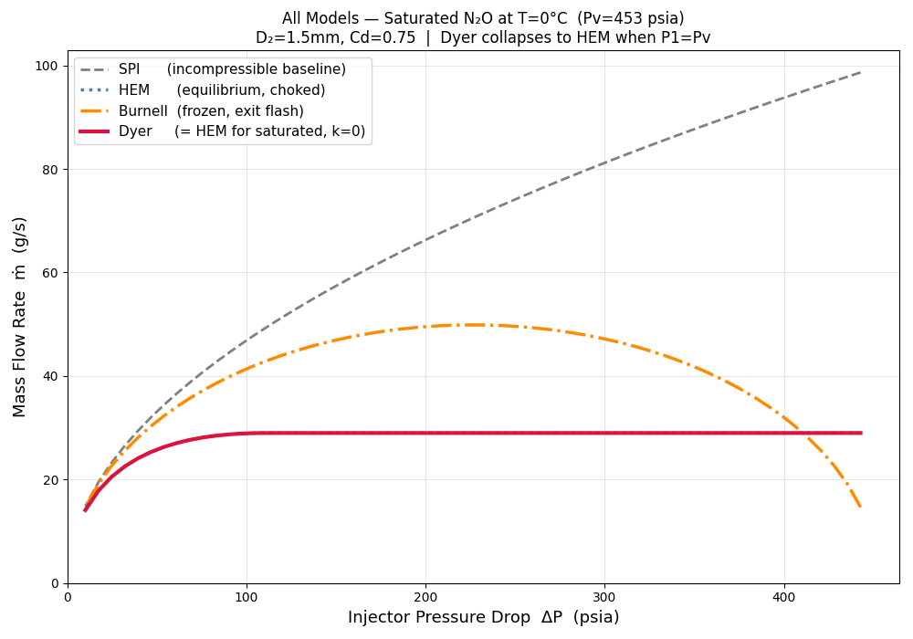

**Dyer mass flow at varying supercharge.** As supercharge rises, Dyer moves from the HEM bound toward SPI.
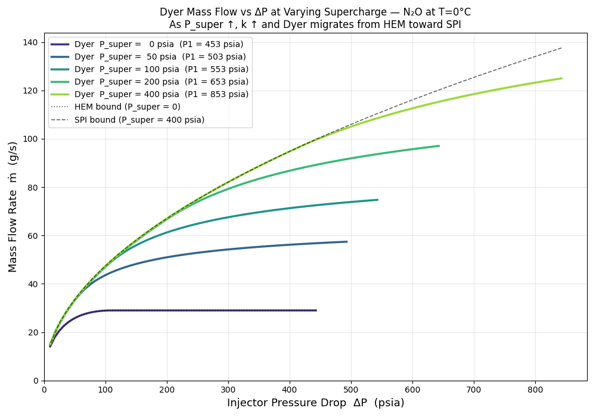

**Dyer k parameter at varying supercharge**
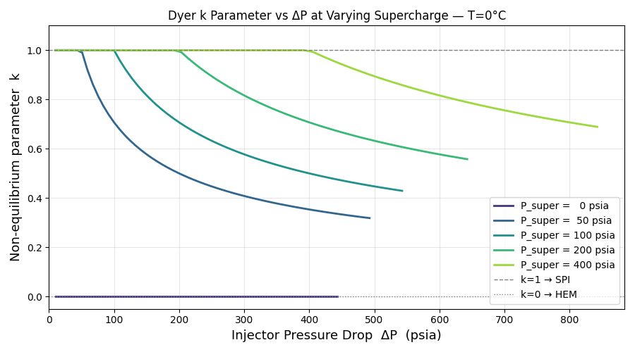

## CO₂ validation (`validation.py`)

**Injector 2: square edge, L/D = 12.3**
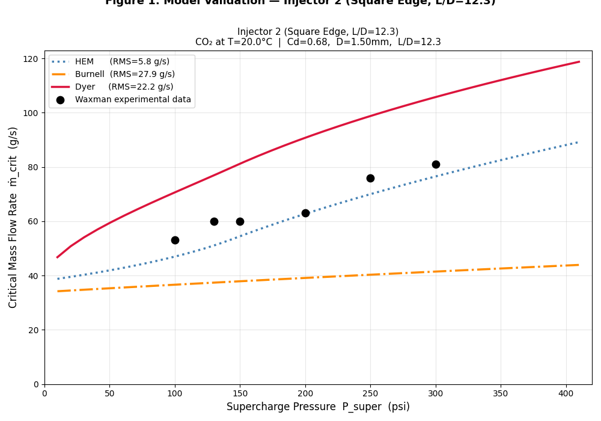

**Injector 3: rounded, L/D = 12.3**
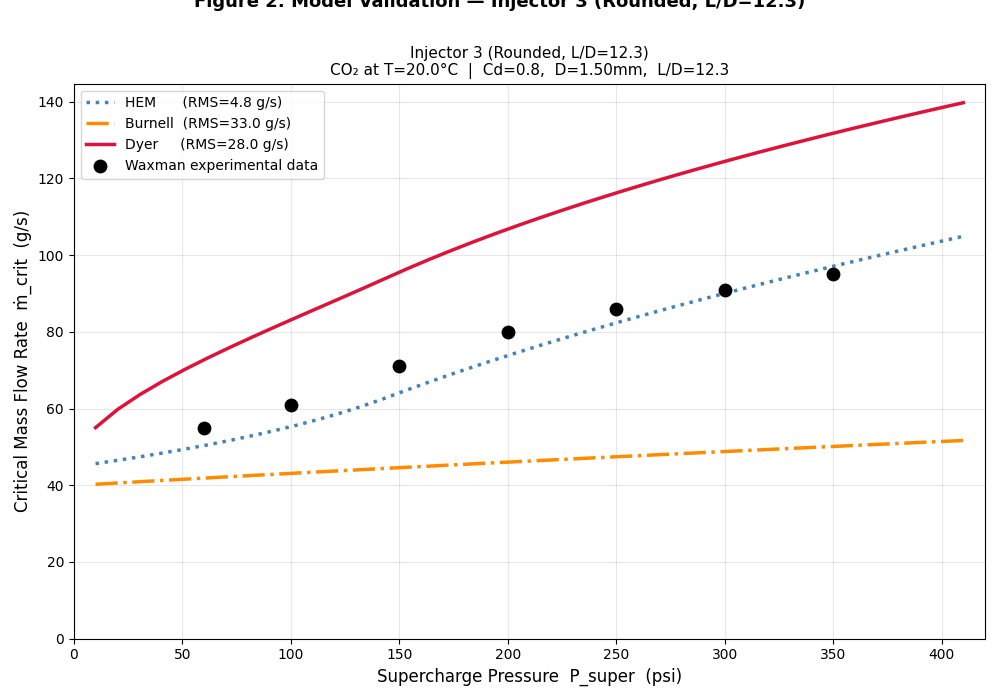

**Injector 4: chamfered, L/D = 12.3**
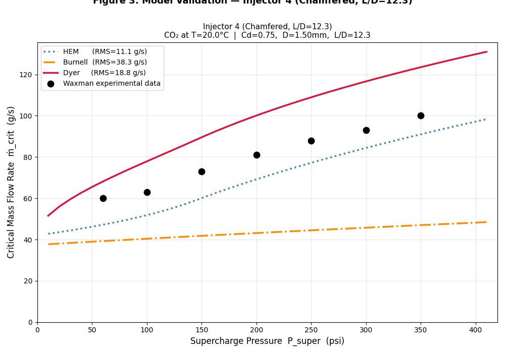

**Injector 6: square edge, L/D = 2.1**
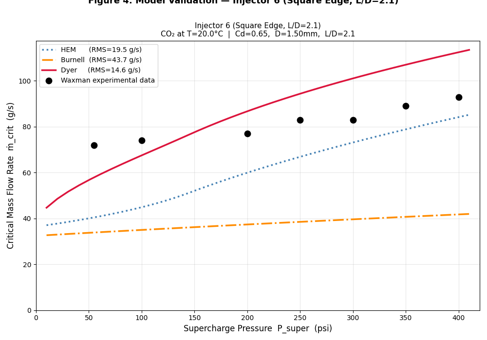

**RMS error summary across all injectors**
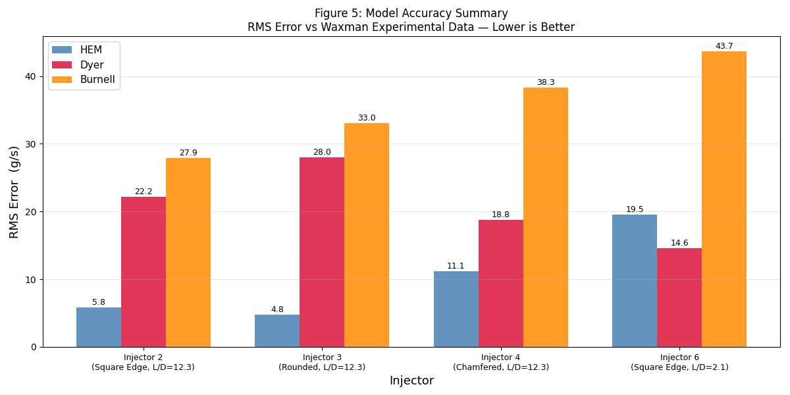